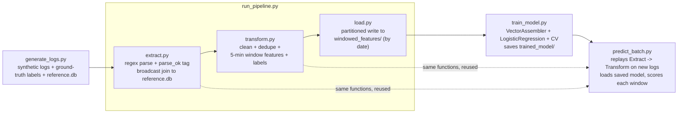

# Spark Log-Anomaly Pipeline

An end-to-end batch pipeline that ingests raw web-server access logs, groups
them into 5-minute time windows, engineers per-window features, trains an
MLlib logistic-regression classifier to flag anomalous windows, and scores
newly arrived log batches against the trained model.

Everything runs on a single local Spark instance (`local[*]`), driven by
plain Python scripts. The data is synthetic: a generator produces logs with
*knowable* ground truth (which windows were injected as anomalous, and of what
kind), so the pipeline can be evaluated with a defensible precision / recall /
F1 report card instead of a heuristic proxy label.

The point of this project is the *pipeline discipline*, not the model: clean
stage boundaries, verification at every step, real measured numbers, an honest
optimization pass, and an evaluation that does not oversell what a synthetic
dataset can prove.

## Repository layout

| File | Role |
|------|------|
| `generate_logs.py` | Phase 0 — synthetic log generator (logs + ground truth + reference DB) |
| `extract.py` | Phase 1 — parse raw lines, tag `parse_ok`, broadcast-join to reference metadata |
| `transform.py` | Phase 2 — clean, dedupe, 5-minute window features, attach ground-truth labels |
| `load.py` | Phase 3 — write the final partitioned `windowed_features/` deliverable |
| `run_pipeline.py` | Phase 4 — run Extract → Transform → Load in one shared Spark session |
| `train_model.py` | Phase 6 — train LR (VectorAssembler + CV), save the model |
| `predict_batch.py` | Phase 7 — replay Extract → Transform on a new batch, load the model, score |
| `access.log` / `ground_truth_windows.csv` / `reference.db` | generated inputs (gitignored) |
| `windowed_features/` / `trained_model/` / `predictions.parquet/` | generated artifacts (gitignored) |

## Architecture



Training and prediction share **one** feature-engineering implementation
(`transform.py`); `predict_batch.py` calls the existing `run_extract` and
`run_transform` entry points rather than duplicating logic, so a feature
change propagates to both sides automatically.

---

## Phase 0 — Data generation (`generate_logs.py`)

**What was built.** A streaming synthetic-log generator that writes three
artifacts: `access.log` (space-delimited lines
`<timestamp> <endpoint> <status_code> <response_size>`), a ground-truth CSV
with one label per 5-minute window, and a SQLite `reference.db` with endpoint
metadata (15 endpoints, long-tail traffic weights).

**What was measured.** The training dataset:
- 1,500,000 log lines over 7 days (2026-07-01 → 2026-07-07)
- 2,016 five-minute windows; **81 anomalous (4.02%)** — 41 `error`-type and
  40 `size`-type
- 22,438 malformed lines (1.496%), scattered independently of anomaly labels
  so they cannot leak which windows are anomalous

**Key decisions.**
- *Synthetic over real logs:* ground truth must be exact for a defensible
  evaluation. Real logs would need hand-labeled windows, which is subjective.
- *Anomalies live at the window level, not the row level* (traffic bursts of
  errors, or inflated response sizes), which matches how an ops team would
  actually investigate — "something went wrong in these 5 minutes."
- *Malformed rows are label-independent* by construction, so parsing quality
  cannot be gamed as a shortcut.

---

## Phase 1 — Extract (`extract.py`)

**What was built.** Reads `access.log` as unstructured text, splits each line
with an anchored regex into `timestamp / endpoint / status_code /
response_size`, and tags failures with `parse_ok=False` instead of dropping
them. Joins the parsed rows to `reference.db` endpoint metadata.

**What was measured (from the end-to-end run).**
- 1,500,000 rows in → 1,500,000 rows out (nothing lost)
- 22,438 rows tagged `parse_ok=False` (1.496%)
- `broadcast join used: True`, `join preserved all rows (no drop/dup): True`

**Key decisions.**
- *Tag-and-keep, don't drop:* cleaning is Transform's responsibility; Extract
  only marks. This keeps a single owner of the drop decision.
- *Broadcast join:* the reference table is 15 rows vs. 1.5M log rows, so
  broadcasting it (avoiding a full shuffle) is trivially correct and applied
  early — it was verified in the physical plan
  (`BroadcastHashJoin ... BuildRight`).
- *Anchored regex with `^...$`:* forces a full-line match, so malformed lines
  fail cleanly rather than being mis-parsed.

---

## Phase 2 — Transform (`transform.py`)

**What was built.** Drops `parse_ok=False` rows, casts to real types, removes
exact duplicates, buckets rows into 5-minute windows (UTC-pinned to the same
boundaries as the ground truth), computes global per-window features
(request count, error rate, avg and p95 response size), and attaches the
real ground-truth labels.

**What was measured (from the end-to-end run).**
- 1,500,000 rows in → **2,016 windows out**
- Cleaning: 22,438 dropped (parse failures) → 1,477,562 rows; 219 exact
  duplicates removed → 1,477,343 rows
- 2,016 windows after the ground-truth join; 81 anomalous; **0 windows with
  NULL features**, **0 windows with NULL labels** (every ground-truth window
  had data, and every window matched its label)
- Error-rate distribution: min 0.00%, max 53.73%, mean 3.87%, p95 5.06%;
  1,608 distinct values; 10 windows at exactly 0%. Histogram: 1,914 windows
  at 0–5%, 61 at 5–15%, 3 at 15–40%, 38 at 40–100% — the injected error
  bursts sit far above the normal band.

**Key decisions.**
- *`F.window` with a UTC session timezone:* pins the 5-minute floor to the
  exact boundaries used by `ground_truth_windows.csv`, so the join matches
  cleanly (proved by 0 NULL labels).
- *Left join starting from ground truth:* all 2,016 GT windows survive even
  if one had no clean rows — a window with missing features is *visible* as
  NULL, not silently dropped.

---

## Phase 3 — Load (`load.py`)

**What was built.** Adds a `date` column derived from `window_start` and
writes the final partitioned deliverable `windowed_features/` (partitioned by
date), then round-trip-verifies it.

**What was measured.**
- 2,016 rows in → 2,016 rows out
- **7 date partitions × 288 rows** each (2026-07-01 … 2026-07-07)
- Schema round-trip: `schema matches (no coercion): True`. Columns:
  `window_start` (timestamp), `is_anomalous` (int), `anomaly_type` (string),
  `total_requests` (long), `error_rate`, `avg_response_size`,
  `p95_response_size` (double). The derived `date` column flips
  StringType → DateType on re-read — normal Spark partition-column
  inference, excluded from the check.

**Key decisions.**
- *Partition by date, not hour:* 288 rows per date partition is sensible;
  hour partitions would hold ~12 rows each and cost more than they save at
  this scale.
- *Generated data is gitignored:* everything is reproducible by running the
  scripts, so outputs stay out of git (previously committed copies remain in
  history, untracked, no rewrite).

---

## Phase 4 — Integration (`run_pipeline.py`)

**What was built.** An orchestrator that creates **one** shared SparkSession
and calls the stage entry points in order, reporting rows-in / rows-out /
wall-clock elapsed per stage.

**What was measured (baseline, full 1.5M-row run, default settings).**

| Stage | Rows in → out | Elapsed |
|-------|---------------|---------|
| Extract | 1,500,000 → 1,500,000 | 84.45 s |
| Transform | 1,500,000 → 2,016 | 83.01 s |
| Load | 2,016 → 2,016 | 3.05 s |

**Key decisions.**
- One session avoids JVM/Spark startup cost per stage and lets stages share
  cached metadata.
- Stages still write/read parquet to disk (same contract as standalone runs),
  so any stage can be re-run independently.

---

## Phase 5 — Performance optimization

**Goal.** Apply a small number of *explainable* Spark execution changes, each
measured **one at a time**, with correctness re-verified after every change.
No knob-grabbing, no horizontal scaling — single-machine local Spark only.

**Diagnosis (DAG substitute).** No browser / Spark-UI screenshots were
available in this environment, so the DAG evidence was captured two other
ways: the physical plan via `df._jdf.queryExecution().executedPlan().toString()`
and per-stage shuffle metrics via the running app's REST API
(`/api/v1/applications/{id}/stages`). The executed plans show both Transform
shuffles hash-partitioning into **200** partitions:

```
dedupe:  Exchange hashpartitioning(timestamp, endpoint, status_code, response_size, 200)
window:  Exchange hashpartitioning(window, 200)
```

**Before / after (Transform stage wall-clock, one change at a time):**

| Run | Change | Transform | vs baseline |
|-----|--------|-----------|-------------|
| Baseline | current settings (`shuffle.partitions=200`) | 83.01 s | — |
| + opt 1 | `--shuffle-partitions 8` | 37.28 s | –55% |
| + opt 2 | dedupe computed once (no separate `distinct().count()`) | 65.74 s | –21%* |
| + opt 3 | cache the 2,016-row window-features result | 27.06 s | –67%* |
| **Combined** | all three | **17.12 s** | **–79%** |

*Optimization 2 and 3 were measured individually on top of the baseline
settings (200 partitions), so their vs-baseline deltas are standalone; the
combined run applies all three together.

REST stage metrics for the 8-partition run confirm the shuffle reduction
(8 reduce tasks, 26,281,784 B shuffle read / 361,025 B write per dedupe and
window stage), versus the 200-partition plan.

**Why each change works (one line each).**
1. *Shuffle partitions 200 → 8:* both Transform shuffles produced 200 tiny
   reduce partitions on a 12-core laptop — 8 matches the available
   parallelism and cuts reduce overhead (~30MB shuffle per stage).
2. *Dedupe once:* `distinct().count()` and `dropDuplicates()` are the same
   operation run twice; deriving the duplicate count from the single
   deduplicated frame removes one full shuffle over ~1.48M rows.
3. *Cache the 2,016-row window result:* the verification step runs ~15 Spark
   actions over the labeled frame; without caching, each re-executed the
   window aggregation *and* the dedupe shuffle. The tiny window result fits
   comfortably in memory, so all downstream actions read from cache.

**The experiment that made things worse (kept honest).** Caching the
*1.48M-row deduped frame* (`MEMORY_ONLY`) was tried and measured at
**323.72 s** — 4× *slower* than the 83.01 s baseline. Under default driver
memory the blocks got evicted and every downstream action re-computed the
dedupe shuffle. The cache was kept only on the 2,016-row window result, where
it actually helps. This is exactly the kind of measurement the phase existed
to make.

---

## Phase 6 — Model training (`train_model.py`)

**What was built.** `VectorAssembler` + MLlib `LogisticRegression` in a
pipeline, trained on the windowed features. Hyperparameters searched with
`ParamGridBuilder` + `CrossValidator`, then the best pipeline is saved to
`trained_model/` in MLlib's native format (loadable via `PipelineModel.load`,
no pickling).

**Split.** Chronological, not random: 2,016 windows sorted by `window_start`,
first 80% train, last 20% test. Train ends at **2026-07-06 14:15:00 UTC**,
test starts at **2026-07-06 14:20:00 UTC**. Train: 1,612 windows
(1,543 normal / 69 anomalous). Test: 404 windows (392 normal / 12 anomalous).
A random split would train on future windows whose anomaly bursts the model
could memorize — the chronological split is the honest estimate of predicting
unseen time.

**Hyperparameter search.** 9 combos (`regParam` × `elasticNetParam`), 3 folds,
`areaUnderROC`. All combos scored 1.0000 except `regParam=1.0` with
`elasticNetParam ∈ {0.5, 1.0}` → 0.5000 (strong L1 regularization collapses
to majority class). Best: **`regParam=0.01, elasticNetParam=0.0`** (pure L2).
Honest caveat: with ~69 positives in the train set, 3-fold CV is a light
sensitivity check, not robust model selection.

**Test metrics (held-out time-based test, default threshold 0.5).**

| | predicted normal | predicted anomalous |
|---|---|---|
| **actually normal** | TN = 392 | FP = 0 |
| **actually anomalous** | FN = 0 | **TP = 12** |

- Accuracy 100.00%, precision 1.0000, recall 1.0000, F1 1.0000
- Predicted class distribution on test: `{0: 392, 1: 12}` (not all-one-class)

**Why recall, not accuracy, is the metric that matters.** 12/404 (~3.0%) test
windows are anomalous; a model predicting "never anomalous" scores ~97%
accuracy while catching 0 anomalies. On an alerting task a missed anomaly
costs far more than a false alarm, so the confusion matrix is the real report
card.

**Coefficient sanity check** (fitted LR, log-odds per 1-unit feature change):

| Feature | Coefficient | Expected | |
|---------|-------------|----------|---|
| `error_rate` | **+20.283957** | strong positive | ✓ error bursts → anomalous |
| `avg_response_size` | +0.000549 | positive | ✓ size anomalies ~8–9k vs ~700 |
| `p95_response_size` | +0.000173 | positive | ✓ same mechanism |
| `total_requests` | −0.000076 | ~0 (not decisive) | ✓ traffic volume alone doesn't separate |

Intercept −7.309759. Signs and magnitudes match the anomaly-injection
mechanism.

---

## Phase 7 — Batch prediction on genuinely unseen data (`predict_batch.py`)

**What was built.** A script that (1) runs a new raw-log file through the
*existing* Extract and Transform functions to rebuild windowed features —
feature logic is not duplicated — (2) loads the saved model, and (3) writes
per-window predictions (label + P(anomalous)) to `predictions.parquet/` and
evaluates them against the new batch's own ground truth.

**The held-out batch is not test-set reuse.** It was generated *after*
training with a fresh random seed (12345) over two new days
(2026-07-08 → 2026-07-09), outside the original 7-day window — a simulated
new batch arriving after the model was built.

**What was measured.**

| Step | Result |
|------|--------|
| Generated batch | 400,000 lines, 6,020 malformed (1.50%), 576 windows, **23 anomalous** (12 error / 11 size) |
| Extract (new batch) | 400,000 → 400,000, broadcast join confirmed |
| Transform (new batch) | 400,000 → 576 windows (51 duplicates removed), 0 NULL-feature/label windows |
| **Predictions** | 576 windows generated, **23 flagged anomalous (3.99%)** |

**Predictions vs. the new batch's ground truth:**

| | predicted normal | predicted anomalous |
|---|---|---|
| **actually normal** | TN = 553 | FP = 0 |
| **actually anomalous** | FN = 0 | **TP = 23** |

- Accuracy 100.00%, precision 1.0000, recall 1.0000, F1 1.0000
- All 23 flagged windows are exactly the 23 ground-truth anomalies, with
  P(anomalous) between 0.85 and 0.98.

**Required honest caveat.** These perfect scores reflect two properties of
the *data*, not proof that the model is production-ready:
1. The synthetic anomalies are cleanly separable (error-type windows at
   ~45–48% error rate vs ~3% normal; size-type windows at ~8–9k avg response
   size vs ~700 normal), so even a default-threshold LR separates them with
   zero errors.
2. The Phase-7 batch is drawn from the *same generator and the same anomaly
   injection logic* as the training data — only the random seed and date
   range differ. A perfect held-out score therefore proves the model did not
   memorize specific windows; it does **not** prove robustness to real-world
   distribution drift.

The pipeline's value is the honest evaluation framework (chronological split,
confusion matrices, coefficient checks, a genuinely fresh held-out batch),
not the 100% figure.

---

## Known limitations

- **Ground truth is synthetic / self-labeled**, not validated by a human or
  a real incident. Every metric in this repo is an estimate of performance on
  *this generator's* anomaly definition.
- **Perfect ML metrics reflect obvious injected signatures**, not subtle
  real-world anomalies. A 1% shift in error rate would not be flagged by this
  model.
- **The Phase-7 held-out batch is distributionally identical** to training
  data — it proves no row-memorization, not generalization to drift. There is
  no experiment here with a shifted distribution, because the generator
  cannot produce one.
- **Single-machine local Spark only.** Timings and tuning (e.g. 8 shuffle
  partitions, the caching decision, broadcast thresholds) are laptop-specific
  (`local[*]`, 12 cores) and will not transfer to a cluster.
- **Single-run numbers.** Timing and CV numbers are one-shot runs, not
  repeated-run averages; some variance is expected (e.g. Extract ranged
  77–84 s across identical runs).
- The model uses the **default decision threshold (0.5)**; with a ~4%
  prevalence a tuned threshold could trade precision vs recall. Not done here
  by design — the plan called for the simplest defensible model.

---

## What I'd do differently at real scale

- **Window aggregation as Structured Streaming, not a batch script.** For
  real-time detection, the window/feature step would be a `tumbling window`
  streaming query emitting per-window features continuously; the batch
  pipeline here is the offline prototype of exactly that computation.
- **A genuine drift-tolerant evaluation strategy.** Real logs have no exact
  ground truth, so you'd need (a) a hand-labeled window sample, (b) ongoing
  incident-feedback labels, and (c) explicit drift detection (PSI on feature
  distributions) rather than assuming the served distribution matches
  training.
- **Multi-node cluster changes everything about the tuning.** Shuffle
  partition count scales with cluster parallelism; caching strategy and
  broadcast-join thresholds (default 10MB) would be sized against executor
  memory and network, not a laptop's driver heap. The 200→8 result is
  evidence of the *method*, not a number to copy.
- **A model registry / versioned artifact store** instead of a local
  `trained_model/` folder — model version, feature schema, training run ID,
  and evaluation metrics stored together so predictions can be traced to the
  exact model that produced them.
- **Dataset versioning and lineage.** `generate_logs.py` overwrites
  `access.log` and ground truth on every run; at scale you'd want
  versioned, immutable datasets and run metadata (e.g. seed, date range,
  config hash) recorded with each pipeline run.
- **A feature store.** Features would be computed once, versioned, and shared
  between training and serving instead of being rebuilt by replaying ETL for
  each new batch.
- **Experiment tracking and repeated-seed CV.** With ~69 positives in the
  train set, single-shot CV is noisy; at scale you'd run nested / repeated
  CV and log every trial, not one grid.

---

## How to run

Environment (Windows / PowerShell; adjust paths to your machine):

```powershell
$env:JAVA_HOME = "C:\Users\sinne\jdk17\jdk-17.0.20+8"
$env:HADOOP_HOME = "C:\Users\sinne\hadoop-utils"
$env:PATH = "C:\Users\sinne\hadoop-utils\bin;$env:PATH"   # hadoop.dll for native IO
$env:SPARK_LOCAL_IP = "127.0.0.1"
$env:PYSPARK_PYTHON = "C:\Users\sinne\AppData\Local\Programs\Python\Python312\python.exe"
$env:PYSPARK_DRIVER_PYTHON = "C:\Users\sinne\AppData\Local\Programs\Python\Python312\python.exe"
```

`JAVA_HOME` and the hadoop DLL (`hadoop.dll` in `hadoop-utils\bin`) are
required on Windows — without them Spark fails with `HADOOP_HOME ... unset`
or `UnsatisfiedLinkError NativeIO$Windows.access0`. The Python path avoids
the Windows Store Python stub.

Full flow, in order:

```powershell
# 1. Generate the training dataset (1.5M lines, 7 days, seed 42)
python generate_logs.py

# 2. End-to-end pipeline (Extract -> Transform -> Load)
python run_pipeline.py                     # baseline settings
python run_pipeline.py --shuffle-partitions 8   # optimized (Transform ~17 s)

# 3. Train + save the model (writes trained_model/)
python train_model.py

# 4. Generate a NEW batch as if it arrived after training
python generate_logs.py --rows 400000 --seed 12345 --days 2 `
    --start-datetime "2026-07-08 00:00:00" --prefix new_batch_

# 5. Score the new batch with the saved model (writes predictions.parquet/)
python predict_batch.py
```

Each stage can also be run standalone (`python extract.py`,
`python transform.py`, `python load.py`) since stages communicate through
parquet files.

Notes:
- All Spark sessions pin `spark.sql.session.timeZone` to UTC so window
  boundaries match the ground truth exactly.
- Timestamps stored on disk are correct UTC; Python/JVM may *display* instants
  in local time (e.g. an India Standard Time machine shows `05:30:00` for
  `00:00:00` UTC). This is a display-only artifact, not a data bug — the
  README's cutoff timestamps are the UTC values.
- The transform verification message prints "expected 2016" even for the new
  batch (it is a training-set constant); the new batch produces 576 windows.

---

## Tech stack

- **Apache Spark / PySpark 3.5.9** (`local[*]`), **Spark SQL**, **MLlib**
  (`pyspark.ml`: VectorAssembler, LogisticRegression, CrossValidator,
  BinaryClassificationEvaluator)
- **OpenJDK 17** (Temurin 17.0.20+8) via `JAVA_HOME`
- **Python 3.12.10**
- **SQLite** (`reference.db`, read via stdlib `sqlite3`)
- **Apache Parquet** for stage-to-stage and final artifacts
- Single-machine Windows development environment; no cluster, no containers,
  no serving layer
